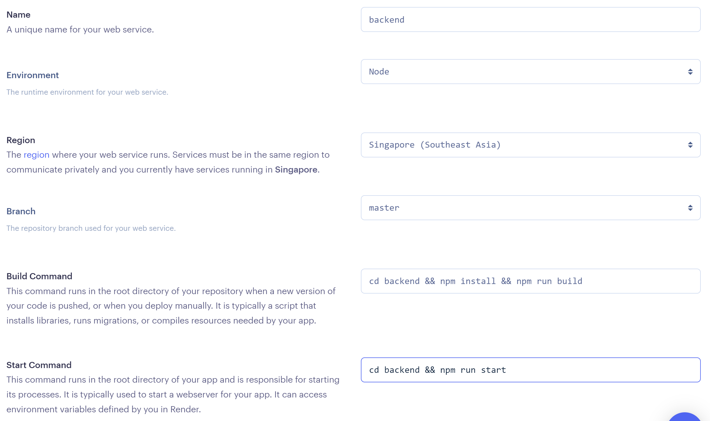

# TypeScript + React + Node.js + Prisma on Render.com サンプルプロジェクト

2022年度新歓カリキュラム全部入り構成。使用しない要素がある場合は適宜除いて考えてください。

https://frontend-yy3x.onrender.com/

## 要点

本番環境と開発環境での差異を意識する必要があります。

- フロントエンド
  - 開発環境: Vite の開発用サーバー
  - 本番環境: Vite により出力された HTML / CSS / JavaScript ファイル群
- バックエンド
  - 開発環境: 今回は `ts-node` を使用 (トランスパイルをしつつ実行できる)
  - 本番環境: TypeScript トランスパイラ (tsc) により出力された JavaScript ファイル群

また、フロントエンドからバックエンドに接続する際の URL が開発環境では `http://localhost:3001` ですが本番環境では異なる点に注意が必要です。この例では Vite の環境変数をトランスパイル時にプログラムに埋め込む機能を用いて切り替えを行っています。

## このリポジトリを作成した手順

```shell
$ npm create vite@latest
✔ Project name: … frontend
✔ Select a framework: › react
✔ Select a variant: › react-ts

Scaffolding project in /home/user/projects/utcode/typescript-react-node-template/frontend...

Done. Now run:

  cd frontend
  npm install
  npm run dev

$ cd frontend
$ npm install
$ touch .env
$ cd ..
$ mkdir backend
$ cd backend
$ npm init -y
$ npm install express cors
$ npm install -D typescript ts-node @types/express @types/cors
$ npx tsc --init
$ npx prisma init
$ touch main.ts
```

その他

- `/frontend/.env` を作成して `VITE_API_ENDPOINT` を `http://localhost:3000` に設定する
- `/backend/package.json` を変更して次のコマンがが使えるようにする
  - `npm run dev`: `ts-node` を使ってトランスパイル前の TypeScript を直接実行する (開発環境用)
  - `npm run build`: `tsc` を使って TypeScript を JavaScript にトランスパイルする
  - `npm start`: `tsc` によって出力された JavaScript を実行する (本番環境用)
- `/backend/.env` の `DATABASE_URL` を設定する
- `/backend/prisma/schema.prisma` をデータベースに反映させるために `npx prisma db push` を実行する
- `/backend/tsconfig.json` の `outDir` オプションを `./dist` にしてトランスパイル結果が `/backend/dist` に入るようにする
- `/backend/dist` を `/backend/.gitignore` に追加する

## 使い方

- Express の起動: `cd frontend && npm run dev`
- Vite 開発用サーバーの起動: `cd backend && npm run dev`

## デプロイ手順

まずはバックエンドからデプロイすると良い。バックエンドは `Web Service` を選ぶ。


バックエンドの設定はこんな感じ。



加えて環境変数 `DATABASE_URL` を入れる。


フロントエンドは `Static Site` を選ぶ。


フロントエンドの設定はこんな感じ。


加えて環境変数 `VITE_API_ENDPOINT` に先ほどデプロイしたバックエンドの URL を入れる。


これで完成。
